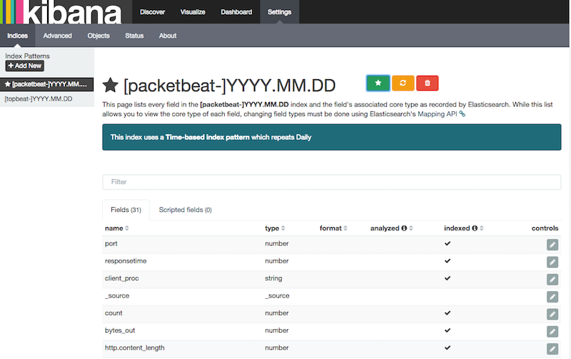

### Installing Kibana

### Reference
* [Kibana official document](https://www.elastic.co/guide/en/kibana/current/index.html)
* [How to install logstash on linux ](./logstash-for-linux.md)
* [How to install kabana on linux ](./kibana-for-linux.md)
* [How to install filebeat on linux ](./filebeat.md)
* [Logstash official document](https://www.elastic.co/guide/en/logstash/current/index.html)

*deb or rpm:*

```shell
	curl -L -O https://download.elastic.co/kibana/kibana/kibana-4.3.1-linux-x64.tar.gz
	tar xzvf kibana-4.3.1-linux-x64.tar.gz
	cd kibana-4.3.1-linux-x64/
	./bin/kibana
```
*mac:*

```shell
	curl -L -O https://download.elastic.co/kibana/kibana/kibana-4.3.1-darwin-x64.tar.gz
	tar xzvf kibana-4.3.1-darwin-x64.tar.gz
	cd kibana-4.3.1-darwin-x64/
	./bin/kibana
```

*win:*

* Download the Kibana 4.3.1 Windows zip file from the
https://www.elastic.co/downloads/kibana[downloads page].
* Extract the contents of the zip file to a directory on your computer, for example, `C:\Program Files`.
* Open a command prompt as an Administrator and navigate to the directory that
contains the extracted files, for example:

```bat
	cd C:\Program Files\kibana-4.3.1-windows
```

* Run the following command to start Kibana:

```bat
	bin\kibana.bat
```


### Launching the Kibana Web Interface

To launch the Kibana web interface, point your browser to port 5601. For example, `http://127.0.0.1:5601`.

You can learn more about Kibana in the
http://www.elastic.co/guide/en/kibana/current/index.html[Kibana User Guide].


### Loading Kibana Dashboards

```shell
	curl -L -O http://download.elastic.co/beats/dashboards/beats-dashboards-1.0.1.tar.gz
	tar xzvf beats-dashboards-1.0.1.tar.gz
	cd beats-dashboards-1.0.1/
	./load.sh
```

NOTE: If Elasticsearch is not running on `127.0.0.1:9200`, you need to
specify the Elasticsearch location as an argument to the `load.sh` command:
`./load.sh http://192.168.33.60:9200`

The load command uploads the example dashboards, visualizations, and searches
that you can use. The load command also creates index patterns for each Beat:

   - [packetbeat-]YYYY.MM.DD
   - [topbeat-]YYYY.MM.DD
   - [filebeat-]YYYY.MM.DD

After loading the dashboards, Kibana raises a `No default index
pattern` error. You must select or create an index pattern to continue. You can
resolve the error by refreshing the page in the browser and then setting one of
the predefined index patterns as the default.



To open the loaded dashboards, go to the `Dashboard` page and click the
*Load Saved Dashboard* icon. Select `Packetbeat Dashboard` from the list.
You can then easily switch between the dashboards by using the `Navigation` widget.

image:./images/kibana-navigation-vis.png[Navigation widget in Kibana]

Of course, you won't see actual data until you've installed and
configured your Beat.

Enjoy!